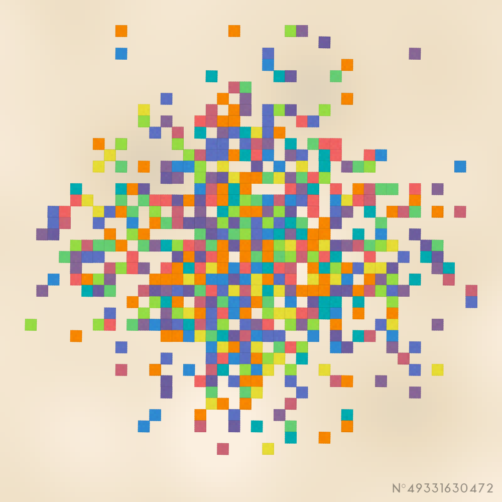
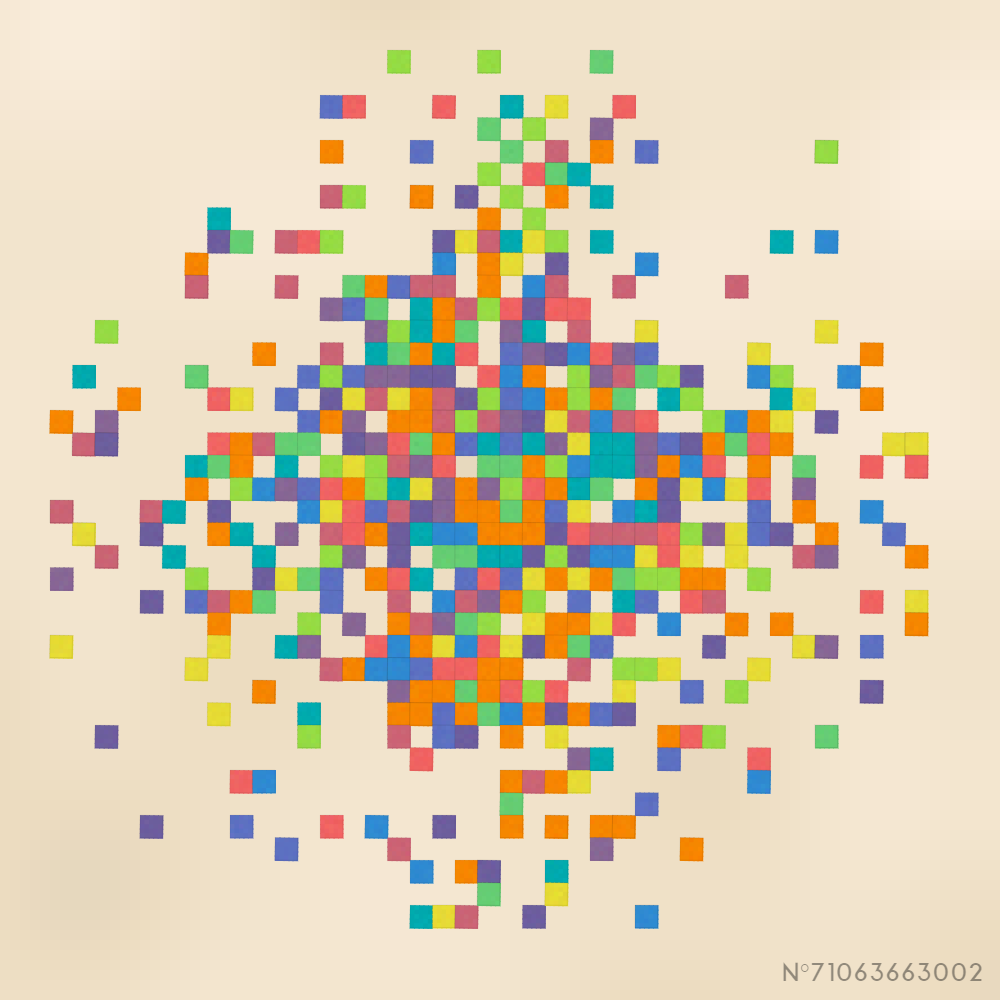
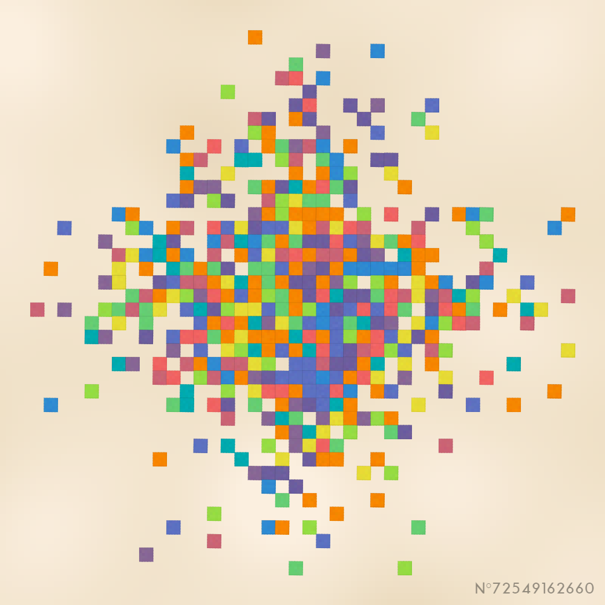
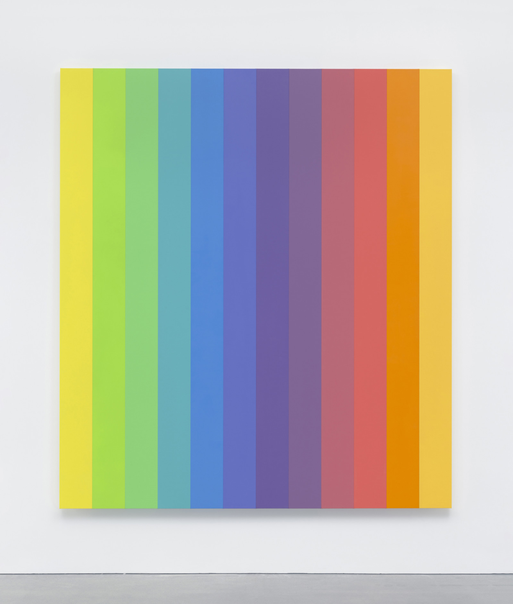
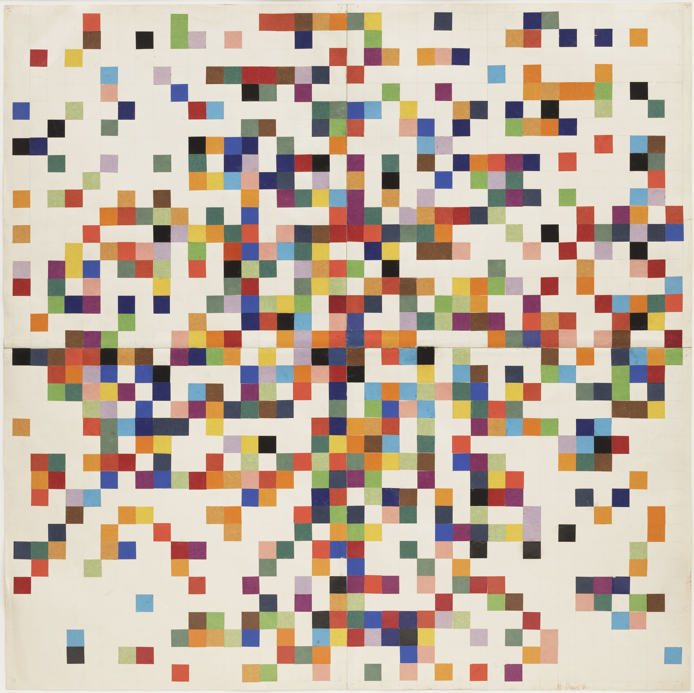

# Random Ellsworth Kelly

## Output

## Sources

## Credits

This project is distributed under Attribution 4.0 International (CC BY 4.0) license.

Font used: Aqua Grotesque by Laura Pol.

XOR128 algorithm based on the implementation by [WizCorp](https://github.com/Wizcorp/xor128/).