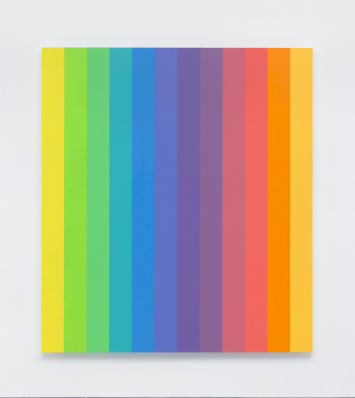
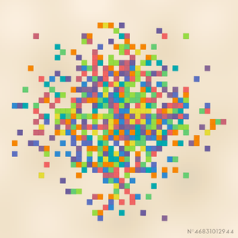
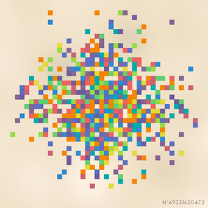
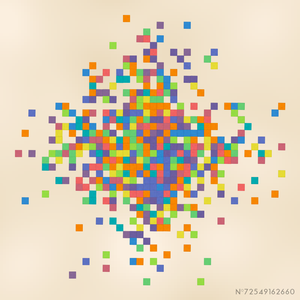

# Random Ellsworth Kelly

## Try it here! [lorenzoros.si](https://www.lorenzoros.si/random-ellsworth-kelly)

## Background

Ellsworth Kelly has been an american painter and sculptor that I discovered by mistake while mindlessly scrolling through my Instagram feed.
He became famous thanks to his beautiful style, now called *"hard-edge painting"*, where each of his canvas was composed by simple color palettes and shapes all abruptly interrupting each other.

*Spectrum colors* and *Spectrum colors arranged by chance* are perhaps two of his most famous works.
Needless to say, I instantly fell in love with its minimalistic paintings and *I HAD TO* try and replicate his work in some form of automated way.

*Why?* , I hear you asking.
Well, all I know is that *I had to*.

Each painting is completely unique and will never be replicated.
In order to achieve that goal, I implemented my own version of the `XOR128` random algorithm.

Feel free to click around and generate a painting until you find one that you like.

Then, you can download and keep it forever!
*I mean, it's file. For sure I won't be able to steal it.*

### Output

## Credits

This project is distributed under Attribution 4.0 International (CC BY 4.0) license.

Font used: Aqua Grotesque by Laura Pol.

`XOR128` algorithm based on the implementation by [WizCorp](https://github.com/Wizcorp/xor128/).
