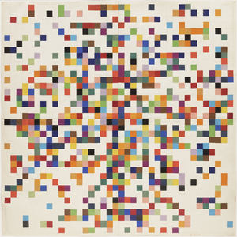
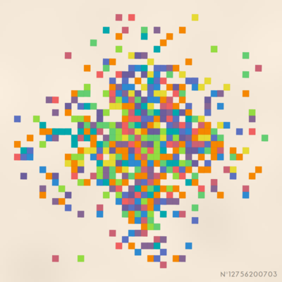
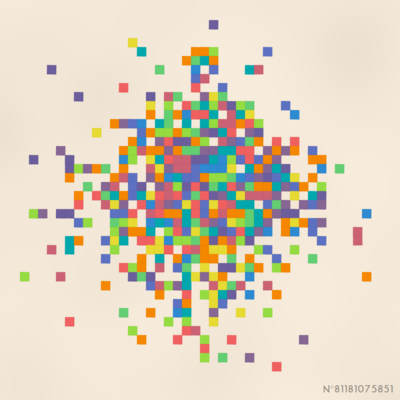
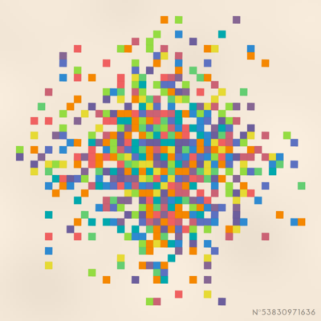
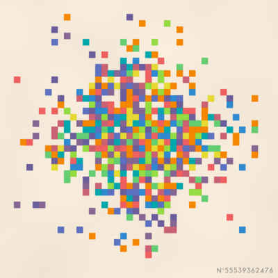

# Random Ellsworth Kelly

## Try it here! [lorenzoros.si](https://www.lorenzoros.si/random-ellsworth-kelly)

## Background

Ellsworth Kelly has been an American painter and sculptor that I discovered by mistake while mindlessly scrolling through my Instagram feed, which I rarely (if ever!) open.

He is often associated with Color Field painting and Minimalism, but he is famous for his beautiful style, now called *"hard-edge painting"*, where each of his canvases was composed of simple colour palettes and shapes all abruptly interrupting each other.

I find it very modern, if not futuristic, and I love how it's possible to create such a beautiful piece of art with so few elements, placed with such precision.

*Spectrum Colors IX* (on the left) and *Spectrum Colors Arranged ny Chance* (on the right) are perhaps two of his most famous works.

 

## About this project

Needless to say, I instantly fell in love with its minimalistic paintings and *I HAD TO* try and replicate his work in some form of automated way.

*Why?*, I hear you asking.
*Why would you do such a thing?*

Well, all I know is that *I had to*.
So I did.

I recently attended a seminar on *Computer Security* (completely unrelated to this project) and the host explained how Computer Scientists (and students like me) have a tendency to create projects that are absolutely useless (and often extremely complicated) just for the sake of doing it, or just because they feel they have to.
I felt almost attacked.

### How does this work?

Each painting is completely unique and will never be replicated.
In order to achieve that goal, I re-implemented the `XOR128` random algorithm, originally made by [WizCorp](https://github.com/Wizcorp/xor128/):
every time you click on the canvas, or when the page is first loaded, the current time is used as a seed to start the generation of the page.
This, in turn, determines:

- the title of the painting
- the position of the shapes
- the colors of the shapes
- the variation from the original color palette
- the texturing on the background

I really like the idea of having a unique painting every time the page is visited, making it a sort of testament of the exact instant in time when the "painting" was created;
however, I felt that by giving the possibility of downloading the painting, it would be possible to save that exact moment and replicate it without having to wait for the exact same time to come again.

Try to click around and generate a painting until you find the moment that you like the most.
Then, you can download and keep it forever!
*I mean, it's just a file. A huge list of zeros and ones. For sure I won't be able to steal it.*

#### Output generation

The real reason that brought me to implementing (again) a random function is that the one provided by the `Math` library does not support seeding.
This is a feature that I really needed, because I wanted to be able to generate the same painting every time I wanted to, and be sure that a particular painting would never be generated again (of course this is true only on a limited number of cases, since there are high chances of collision, but this is good enough for me).

I could have used an already existing function, but this gave me the opportunity to learn how to ~~steal code from someone else~~ implement a random function from scratch;
i then included both the `XOR128` and the Simplex Noise function (originally made by [Jonathan Wagner](https://github.com/jwagner/simplex-noise.js) in the framework that I use for all these kinds of projects.

- The title of the painting is generated by shuffling the digits of a random number
- The probability of a shape being generated in each possible position is calculated by considering the Manhattan distance from the center of the canvas
  - the shapes are then offset and rotated by a small amount, to make them look more natural
  - the color of the shape is picked randomly from a palette sampled from the painting *"Spectrum Colors IX"*, shown above, and then offset by a random amount in each channel
- A noise function is used to generate a texture on the background, which is then blurred to make it look more natural

I was surprised by how quick this whole process was, and I'm really happy with the result.
As I often do, I forgot this project buried deep in the depths of the repositories on GitHub, and I only remembered about it when I was looking for something else.

*But hey, at least I finished it.*

### Output

These are some of the paintings that this web page is able to generate.
Do you feel that they were made by Ellsworth Kelly himself? I don't, but I feel that they are close enough.

 

 

## Credits

This project is distributed under Attribution 4.0 International (CC BY 4.0) license.

Font used: Aqua Grotesque by Laura Pol.

`XOR128` algorithm based on the implementation by [WizCorp](https://github.com/Wizcorp/xor128/).
